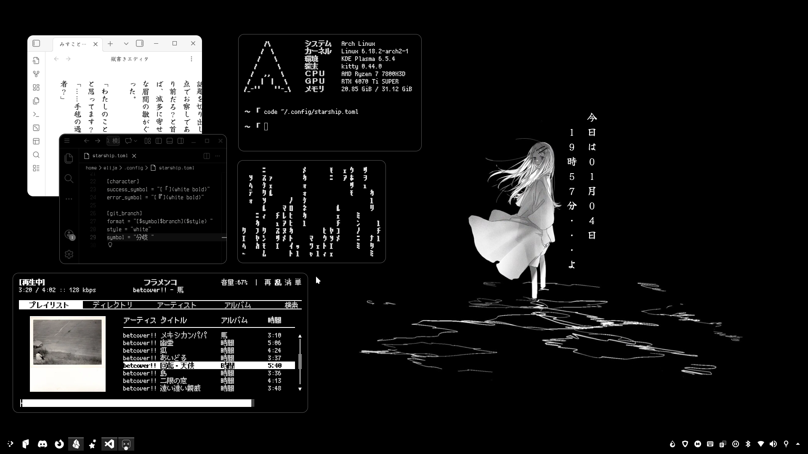
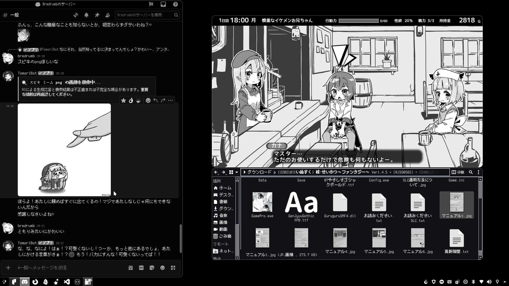
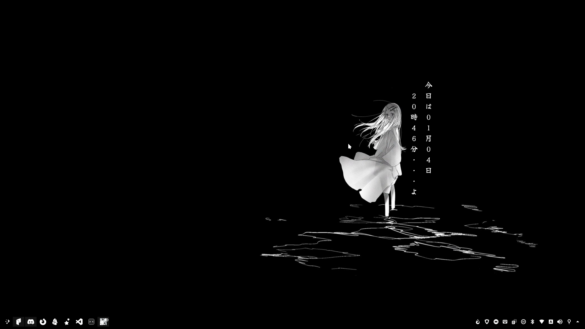

First "rice", a simple monochrome Japanese KDE Plasma (ft. 篠澤広). Couldn't decide between full retro or modern sleek lmao, will get updated while I tweak it some more. Illustrations by [8root5](https://x.com/i/status/1795390082238816483) and [kikupsyche](https://twitter.com/kikuPsyche/status/1911820215744377206)
- Fonts: PixelMplus, Terminess Nerd, Yuji Syuku
- VSCode Theme: Monochrome Dark Amplified (Monochrome Extension)
- Desktop Theme: Carl
  - Application Style: MS Windows 9x
  - Plasma Style: Breeze Dark
  - Icons: Papirus-Dark
  - Cursor: Breeze Light
  - Desktop Effect: Rounded Corners 
- System Locale: Japanese

Other configs and assets are uploaded in the repo

# Previews

